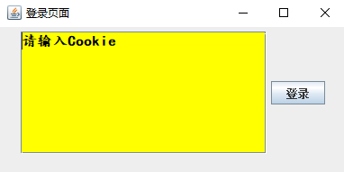
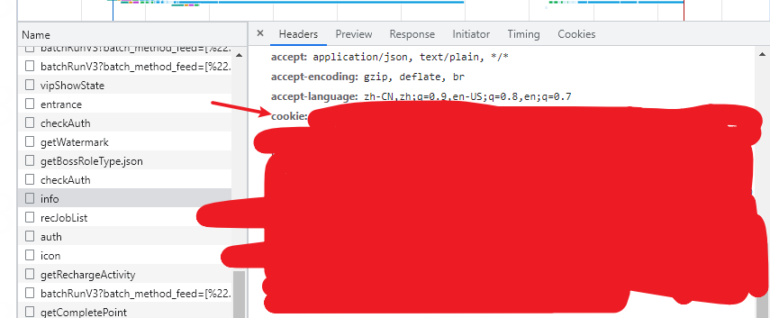
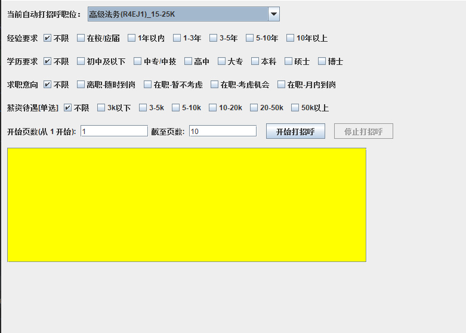

### boss 直聘自动向牛人打招呼

java Swing 项目

idea 需要安装 lombok 插件


### 使用
1. 启动项目后，会出现一个登录框


2. 拿到在 boss 直聘后台的 cookie


3. 登录后的页面长这样



### 如何修改每次打招呼的睡眠时间？
默认的范围是 [10,20) 秒  打一次招呼
设置系统环境变量
```properties
boss.hello.sleepStart=10
boss.hello.sleepEnd=20
```